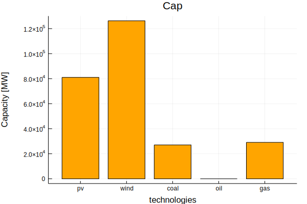

Examples
=========
Here, we present some examples.

## CO2-Limitation
```julia
using CapacityExpansion
using Clp
optimizer=Clp.Optimizer #select an Optimize
state="GER_1" #select state
ts_input_data = load_timeseries_data_provided(state; K=365, T=24)
cep_data = load_cep_data_provided(state)
ts_clust_data = run_clust(ts_input_data;method="kmeans",representation="centroid",n_init=5,n_clust=5).clust_data
# tweak the CO2 level
co2_result = run_opt(ts_clust_data,cep_data,optimizer;descriptor="co2",limit_emission=Dict{String,Number}("CO2/electricity"=>50))
```
## Slack variables included
```julia
slack_result = run_opt(ts_clust_data,cep_data,optimizer;descriptor="slack",lost_load_cost=Dict{String,Number}("electricity"=>1e6), lost_emission_cost=Dict{String,Number}("CO2"=>700))
```
## Simple storage
!!! note
    In simple or intradaystorage the storage level is enforced to be the same at the beginning and end of each day. The variable 'INTRASTORAGE' is tracking the storage level within each day of the representative periods.
```julia
simplestor_result = run_opt(ts_clust_data,cep_data,optimizer;descriptor="simple storage",storage="simple",conversion=true)
```
## Seasonal storage
!!! note
    In seasonalstorage the storage level is enforced to be the same at the beginning and end of the original time-series. The new variable 'INTERSTORAGE' tracks the storage level throughout the days (or periods) of the original time-series. The variable 'INTRASTORAGE' is tracking the storage level within each day of the representative periods.
```julia
seasonalstor_result = run_opt(ts_clust_data,cep_data,optimizer;descriptor="seasonal storage",storage="seasonal",conversion=true))
```
## Second stage operational validation step
```julia
design_result = run_opt(ts_clust_data,cep_data,optimizer;descriptor="design&operation", limit_emission=Dict{String,Number}("CO2/electricity"=>50))
#the design variables (here the capacity_factors) are calculated from the first optimization
design_variables=get_cep_design_variables(design_result)
# Use the design variable results for the operational (dispatch problem) run
operation_result = run_opt(ts_input_data,cep_data,design_result.config,design_variables,optimizer;lost_load_cost=Dict{String,Number}("electricity"=>1e6), lost_emission_cost=Dict{String,Number}("CO2"=>700))
```
## Plotting Capacities
```julia
co2_result = run_opt(ts_clust_data,cep_data,optimizer;descriptor="co2",limit_emission=Dict{String,Number}("CO2/electricity"=>500)) #hide


# use the get variable set in order to get the labels: indicate the variable as "CAP" and the set-number as 1 to receive those set values
variable=co2_result.variables["CAP"]
labels=axes(variable,"tech")

data=variable[:,:,"germany"]
# use the data provided for a simple bar-plot without a legend
bar(data,title="Cap", xticks=(1:length(labels),labels),legend=false, ylabel="Capacity [MW]", xlabel="technologies", color="orange")
```

